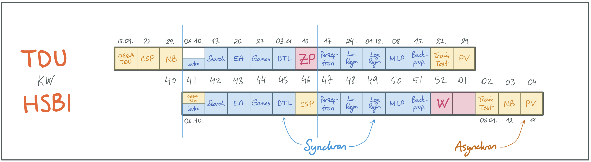

{width="60%"}

[["künstliche
intelligenz"](https://pixabay.com/de/illustrations/k%c3%bcnstliche-intelligenz-netzwerk-3706562/)
by [Gerd Altmann (geralt)](https://pixabay.com/de/users/geralt-9301/) on Pixabay.com
([Pixabay License](https://pixabay.com/de/service/license/))]{.credits}

# Kursbeschreibung

Ausgehend von den Fragen "Was ist *Intelligenz*?" und "Was ist *künstliche*
Intelligenz?" werden wir uns in diesem Modul mit **verschiedenen Teilgebieten der
KI** beschäftigen und uns anschauen, welche **Methoden und Algorithmen** es gibt und
wie diese funktionieren. Dabei werden wir auch das Gebiet *Machine Learning*
berühren, aber auch andere wichtige Gebiete betrachten. Sie erarbeiten sich im Laufe
der Veranstaltung einen **Methoden-Baukasten** zur Lösung unterschiedlichster
Probleme und erwerben ein grundlegendes Verständnis für die Anwendung in Spielen,
Navigation, Planung, smarten Assistenten, autonomen Fahrzeugen, ...

# Überblick Modulinhalte

1.  Problemlösen
    -   Zustände, Aktionen, Problemraum
    -   Suche (blind, informiert): Breiten-, Tiefensuche, Best-First,
        Branch-and-Bound, A-Stern
    -   Lokale Suche: Gradientenabstieg, Genetische/Evolutionäre Algorithmen (GA/EA)
    -   Spiele: Minimax, Alpha-Beta-Pruning, Heuristiken
    -   Constraints: Backtracking, Heuristiken, Propagation, AC-3
2.  Maschinelles Lernen
    -   Merkmalsvektor, Trainingsmenge, Trainingsfehler, Generalisierung
    -   Entscheidungsbäume: CAL2, CAL3, ID3, C4.5
    -   Neuronale Netze
        -   Perzeptron, Lernregel
        -   Feedforward Multilayer Perzeptron (MLP), Backpropagation, Trainings-
            vs. Generalisierungsfehler
        -   Steuerung des Trainings: Kreuzvalidierung, Regularisierung
        -   Ausblick: Support-Vektor-Maschinen
    -   Naive Bayes Klassifikator
3.  ~~Inferenz, Logik~~ (**entfällt im W25**)
    -   ~~Prädikatenlogik: Modellierung, semantische und formale Beweise,
        Unifikation, Resolution~~
    -   ~~Ausblick: Anwendung in Prolog~~

# Team

-   [Carsten
    Gips](https://www.hsbi.de/minden/ueber-uns/personenverzeichnis/carsten-gips)
    (HSBI, Sprechstunde nach Vereinbarung)
-   [Canan Yıldız](http://people.tau.edu.tr/people.show/cananyildiz/de) (TDU)
-   N.N.(TDU)

# Kursformat (HSBI)

{width="80%"}

| Vorlesung (2 SWS): 06.10. - 24.10. | Vorlesung (2 SWS): 27.10. - 23.01. | Praktikum (2 SWS): 06.10. - 23.01. |
|:---------------------------|:---------------------------|:---------------------------|
| Mo, 09:00 - 10:30 Uhr (DE) | Mo, 08:00 - 09:30 Uhr (DE) | G1: Fr, 09:45 - 11:15 Uhr (DE) |
| (online, Zoom) | (online, Zoom) | G2: Fr, 11:30 - 13:00 Uhr (DE) |
|  |  | G3: Fr, 09:45 - 11:15 Uhr (DE) |
|  |  | G4: Fr, 11:30 - 13:00 Uhr (DE) |
|  |  | (online, Zoom) |

Durchführung der Vorlesung als *Flipped Classroom*. Alle Online-Sitzungen per Zoom.
(Zugangsdaten siehe
[ILIAS](https://www.hsbi.de/elearning/goto.php?target=crs_1400597&client_id=FH-Bielefeld))

# Fahrplan (HSBI)

Hier finden Sie einen abonnierbaren [Google
Kalender](https://calendar.google.com/calendar/ical/552fdc6c19e64eda7b36b2d16a88bf4b7e593af2c520afbe1aeeb0bb4f43107d%40group.calendar.google.com/public/basic.ics)
mit allen Terminen der Veranstaltung zum Einbinden in Ihre Kalender-App.

Abgabe der Übungsblätter jeweils **Montag bis 11:00 Uhr** im
[ILIAS](https://www.hsbi.de/elearning/goto.php?target=exc_1420535&client_id=FH-Bielefeld).
Vorstellung der Lösung im jeweiligen Praktikum in der Abgabewoche.

| Monat                | Woche | Vorbereitung                                                                                                                                                                                          | Präsenz                                                                                                                                             | Abgabe Aufgabenblatt                                         | Vorstellung Praktikum |
|:---------------------|:------|:------------------------------------------------------------------------------------------------------------------------------------------------------------------------------------------------------|:----------------------------------------------------------------------------------------------------------------------------------------------------|:-------------------------------------------------------------|:----------------------|
| Oktober              | 41    | [Einführung KI](lecture/intro/intro1-overview.md), [Problemlösen](lecture/intro/intro2-problemsolving.md), [Machine Learning 101](lecture/dtl/dtl1-mlbasics.md), [Perzeptron](lecture/nn/nn01-perceptron.md) | 07.: [Orga](https://www.hsbi.de/elearning/data/FH-Bielefeld/lm_data/lm_1358898/index.html#überblick-modulinhalte) (*Zoom*), Fragen & Vertiefung |                                                              |                       |
|                      | 42    | [Lineare Regression](lecture/nn/nn02-linear-regression.md)                                                                                                                                            | 14.: Anwendungsbeispiele, Fragen & Vertiefung                                                                                                      | 14.: [Blatt: Perzeptron](homework/sheet-nn-perceptron.md)    | 14\. / 15.            |
|                      | 43    | [Logistische Regression](lecture/nn/nn03-logistic-regression.md)                                                                                                                                      | 21.: Vergleich mit linearer Regression, praktische Anwendung                                                                                        |                                                              |                       |
|                      | 44    | [Overfitting](lecture/nn/nn04-overfitting.md), [Multilayer Perceptron](lecture/nn/nn05-mlp.md)                                                                                                       | 28.: Strategien gegen Overfitting, MLP-Architektur im Detail                                                                                        | 28.: [Blatt: Regression](homework/sheet-nn-regression.md)    | 28\. / 29.            |
| November             | 45    | [Backpropagation](lecture/nn/nn06-backprop.md)                                                                                                                                                        | 04.: Algorithmus-Schritte durchgehen, Implementierungsdetails                                                                                      | 04.: [Blatt: MLP](homework/sheet-nn-mlp.md)                  | 04\. / 05.            |
|                      | 46    | [Training & Testing](lecture/nn/nn07-training-testing.md), [Performanzanalyse](lecture/nn/nn08-testing.md)                                                                                           | 11.: Best Practices, Metriken-Auswertung                                                                                                            | 11.: [Blatt: Backpropagation](homework/sheet-nn-backprop.md) | 11\. / 12.            |
|                      | 47    | [Machine Learning 101](lecture/dtl/dtl1-mlbasics.md), [CAL2](lecture/dtl/dtl2-cal2.md), [Pruning](lecture/dtl/dtl3-pruning.md)                                                                      | 18.: [CAL3](lecture/dtl/dtl4-cal3.md), [Entropie](lecture/dtl/dtl5-entropy.md), [ID3 und C4.5](lecture/dtl/dtl6-id3.md), praktische Übungen      |                                                              |                       |
|                      | 48    | 25.: [Tiefensuche](lecture/searching/search1-dfs.md), [Breitensuche](lecture/searching/search2-bfs.md), [Branch-and-Bound](lecture/searching/search3-branchandbound.md), [Best First](lecture/searching/search4-bestfirst.md), [A-Stern](lecture//searching/search5-astar.md)                                                            | Carsten        | 25.: [Blatt: DTL](homework/sheet-dtl.md)                     | 25\. / 26.            |
| Dezember             | 49    | 02.: [Gradientensuche](lecture/searching/search6-gradient.md), [Simulated Annealing](lecture/searching/search7-annealing.md); [Intro EA/GA](lecture/ea/ea1-intro.md), [Genetische Algorithmen](lecture/ea/ea2-ga.md)                                                                                                                     | Carsten        | 02.: [Blatt: Suche](homework/sheet-search.md)                | 02\. / 03.            |
|                      | 50    | 09.: [Optimale Spiele](lecture/games/games1-intro.md), [Games mit Minimax](lecture/games/games2-minimax.md), [Minimax und Heuristiken](lecture/games/games3-heuristics.md), [Alpha-Beta-Pruning](lecture/games/games4-alphabeta.md)                                                                                                      | Carsten        | 09.: [Blatt: EA/GA](homework/sheet-ea.md)                    | 09\. / 10.            |
|                      | 51    | 16.: ~~Projektwoche Semester 1+3~~ Intro Deep Learning und offene Sprechstunde                                                                                                                                                                                                                                                           | Canan, Carsten |                                                              |                       |
|                      | 52    | 23.: *Weihnachtspause*                                                                                                                                                                                                                                                                                                                   |                |                                                              |                       |
|                      | 01    | 30.: *Weihnachtspause*                                                                                                                                                                                                                                                                                                                   |                |                                                              |                       |
| Januar               | 02    | 06.: [Einführung Constraints](lecture/csp/csp1-intro.md), [Lösen von diskreten CSP](lecture/csp/csp2-backtrackingsearch.md), [CSP und Heuristiken](lecture/csp/csp3-heuristics.md), [Kantenkonsistenz und AC-3](lecture/csp/csp4-ac3.md)                                                                                                 | Carsten        | 06.: [Blatt: Games](homework/sheet-games.md)                 | 06\. / 07.            |
|                      | 03    | 13.: [Wahrscheinlichkeitstheorie](lecture/naivebayes/nb1-probability.md), [Naive Bayes](lecture/naivebayes/nb2-naivebayes.md)                                                                                                                                                                                                            | Carsten        | 13.: [Blatt: CSP](homework/sheet-csp.md)                     | 13\. / 14.            |
|                      | 04    | 20.: Rückblick (*Zoom*), [Prüfungsvorbereitung HSBI](admin/exams-hsbi.md)                                                                                                                                                                                                                                                                | Carsten        | 20.: [Blatt: Naive Bayes](homework/sheet-nb.md)              | 20\. / 21.            |
| *(Prüfungsphase I)*  |       | **Klausur**: Di, 04. Feb 2025, 10-18 Uhr (je Klausur 90', Vergabe ca. 2 Wochen vorher)                                                                                                                                                                                                                                                   |                |                                                              |                       |
| *(Prüfungsphase II)* |       | **Klausur**: Di, 01. Apr 2025, 10-16 Uhr (je Klausur 90', Vergabe ca. 2 Wochen vorher)                                                                                                                                                                                                                                                   |                |                                                              |                       |

# Prüfungsform, Note und Credits (HSBI)

**Klausur plus Testat**, 5 ECTS

-   **Testat**: Vergabe der Credit-Points

    Kriterien: Mindestens 6 der 10 Aufgabenblätter erfolgreich bearbeitet.

    ("erfolgreich bearbeitet": Bearbeitung individuell (also in 1er Teams), je
    mindestens 60% bearbeitet, fristgerechte Abgabe der Lösungen im ILIAS,
    Vorstellung der Lösungen im Praktikum)

-   **Klausur**: =\> Modulnote

    Schriftliche Prüfung ("**Klausur**") am Ende des Semesters (in beiden
    Prüfungszeiträumen; [Prüfungsvorbereitung HSBI](admin/exams-hsbi.md)).

Die nächste Klausur für "Grundlagen der KI" wird am **Dienstag, 01. April 2025**
angeboten. Die Klausur wird als digitale Klausur auf dem Prüfungs-ILIAS der HSBI in
Präsenz vor Ort in **Minden im Raum B40** durchgeführt. Die Prüfung für GKI findet
zwischen **10 Uhr bis 16 Uhr** statt (Bekanntgabe der konkreten Startzeit per Mail
ca. eine Woche vor dem Termin) und **dauert 90 Minuten**. Ein DIN-A4-Zettel ist als
Hilfsmittel zugelassen. Der geprüfte Stoff bezieht sich auf den zuletzt
durchgeführten Kurs (Winter 2024/25). Weitere Informationen siehe
[Prüfungsvorbereitung HSBI](admin/exams-hsbi.md).

# Materialien

1.  ["**Artificial Intelligence: A Modern Approach**"](http://aima.cs.berkeley.edu/)
    (*AIMA*). Russell, S. und Norvig, P., Pearson, 2020. ISBN
    [978-0134610993](https://fhb-bielefeld.digibib.net/openurl?isbn=978-0134610993).
2.  "Introduction to Artificial Intelligence". Ertel, W., Springer, 2017. ISBN
    [978-3-319-58487-4](https://fhb-bielefeld.digibib.net/openurl?isbn=978-3-319-58487-4).
    DOI [10.1007/978-3-319-58487-4](https://doi.org/10.1007/978-3-319-58487-4).
3.  "An Introduction to Machine Learning". Kubat, M., Springer, 2017. ISBN
    [978-3-319-63913-0](https://fhb-bielefeld.digibib.net/openurl?isbn=978-3-319-63913-0).
    DOI [10.1007/978-3-319-63913-0](https://doi.org/10.1007/978-3-319-63913-0).
