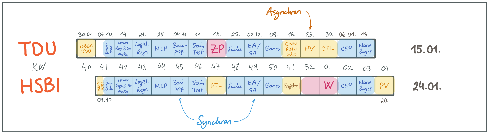

{width="60%"}

[["künstliche
intelligenz"](https://pixabay.com/de/illustrations/k%c3%bcnstliche-intelligenz-netzwerk-3706562/)
by [Gerd Altmann (geralt)](https://pixabay.com/de/users/geralt-9301/) on Pixabay.com
([Pixabay License](https://pixabay.com/de/service/license/))]{.credits}

# Kursbeschreibung

Ausgehend von den Fragen "Was ist *Intelligenz*?" und "Was ist *künstliche*
Intelligenz?" werden wir uns in diesem Modul mit **verschiedenen Teilgebieten der
KI** beschäftigen und uns anschauen, welche **Methoden und Algorithmen** es gibt und
wie diese funktionieren. Dabei werden wir auch das Gebiet *Machine Learning*
berühren, aber auch andere wichtige Gebiete betrachten. Sie erarbeiten sich im Laufe
der Veranstaltung einen **Methoden-Baukasten** zur Lösung unterschiedlichster
Probleme und erwerben ein grundlegendes Verständnis für die Anwendung in Spielen,
Navigation, Planung, smarten Assistenten, autonomen Fahrzeugen, ...

# Überblick Modulinhalte

1.  Problemlösen
    -   Zustände, Aktionen, Problemraum
    -   Suche (blind, informiert): Breiten-, Tiefensuche, Best-First,
        Branch-and-Bound, A-Stern
    -   Lokale Suche: Gradientenabstieg, Genetische/Evolutionäre Algorithmen (GA/EA)
    -   Spiele: Minimax, Alpha-Beta-Pruning, Heuristiken
    -   Constraints: Backtracking, Heuristiken, Propagation, AC-3
2.  Maschinelles Lernen
    -   Merkmalsvektor, Trainingsmenge, Trainingsfehler, Generalisierung
    -   Entscheidungsbäume: CAL2, CAL3, ID3, C4.5
    -   Neuronale Netze
        -   Perzeptron, Lernregel
        -   Feedforward Multilayer Perzeptron (MLP), Backpropagation, Trainings-
            vs. Generalisierungsfehler
        -   Steuerung des Trainings: Kreuzvalidierung, Regularisierung
        -   Ausblick: Support-Vektor-Maschinen
    -   Naive Bayes Klassifikator
3.  ~~Inferenz, Logik~~ (**entfällt im W25**)
    -   ~~Prädikatenlogik: Modellierung, semantische und formale Beweise,
        Unifikation, Resolution~~
    -   ~~Ausblick: Anwendung in Prolog~~

# Team

-   [Carsten
    Gips](https://www.hsbi.de/minden/ueber-uns/personenverzeichnis/carsten-gips)
    (HSBI, Sprechstunde nach Vereinbarung)
-   [Canan Yıldız](http://people.tau.edu.tr/people.show/cananyildiz/de) (TDU)
-   N.N. (TDU)

# Kursformat (TDU)

{width="80%"}

| Vorlesung (2 SWS)          | Übung (2 SWS)           |
|:---------------------------|:------------------------|
| Mo, 10:00 - 11:30 Uhr (TR) | G1: wird bekanntgegeben |
| (online, Zoom)             | G2: wird bekanntgegeben |
|                            | G3: wird bekanntgegeben |
|                            | G4: wird bekanntgegeben |
|                            | (online, Google Meet)   |

Durchführung der Vorlesung als *Flipped Classroom*: Sitzungen per Zoom, Übungen per
Google Meet. (Zugangsdaten siehe [Google
Classroom](https://classroom.google.com/c/NzE4Mzk0NDE5ODEz?cjc=fhzfku3))

# Fahrplan (TDU)

| Woche  | Thema      | Vorlesung: Selbststudium (Vorbereitung)                                                                                                                                                                                        | Vorlesung: Gemeinsame Sitzung                                                                                             | Übung                                                   |
|:-------|:-----------|:-------------------------------------------------------------------------------------------------------------------------------------------------------------------------------------------------------------------------------|:--------------------------------------------------------------------------------------------------------------------------|:--------------------------------------------------------|
| 15.09. | Orga       |                                                                                                                                                                                                                                | [Orga](https://github.com/Artificial-Intelligence-HSBI-TDU/KI-Vorlesung-W25/blob/master/readme_tdu.md) (*Zoom*)           |                                                         |
| 22.09. | CSP        | [Einführung Constraints](lecture/csp/csp1-intro.md) \| [Lösen von diskreten CSP](lecture/csp/csp2-backtrackingsearch.md) \| [CSP und Heuristiken](lecture/csp/csp3-heuristics.md)                                              | [Kantenkonsistenz und AC-3](lecture/csp/csp4-ac3.md) \| **TODO**: Backjumping oder SAT oder Bin Packing                   |                                                         |
| 29.09. | NB         | [Wahrscheinlichkeitstheorie](lecture/naivebayes/nb1-probability.md) \| [Naive Bayes](lecture/naivebayes/nb2-naivebayes.md)                                                                                                     | **TODO**: Bayes'sche Inferenz/Netze                                                                                       | [Blatt: CSP](homework/sheet-csp.md)                     |
| 06.10. | Intro      |                                                                                                                                                                                                                                | **ab 10:45**: [Einführung KI](lecture/intro/intro1-overview.md) \| [Problemlösen](lecture/intro/intro2-problemsolving.md) | [Blatt: Naive Bayes](homework/sheet-nb.md)              |
| 13.10. | Search     | [Tiefensuche](lecture/searching/search1-dfs.md) \| [Breitensuche](lecture/searching/search2-bfs.md) \| [Branch-and-Bound](lecture/searching/search3-branchandbound.md) \| [Best First](lecture/searching/search4-bestfirst.md) | [A-Stern](lecture/searching/search5-astar.md)                                                                             |                                                         |
| 20.10. | EA         | [Gradientensuche](lecture/searching/search6-gradient.md) \| [Simulated Annealing](lecture/searching/search7-annealing.md) \|\| [Intro EA/GA](lecture/ea/ea1-intro.md)                                                          | [Genetische Algorithmen](lecture/ea/ea2-ga.md)                                                                            | [Blatt: Suche](homework/sheet-search.md)                |
| 27.10. | Games      | [Optimale Spiele](lecture/games/games1-intro.md) \| [Games mit Minimax](lecture/games/games2-minimax.md) \| [Minimax und Heuristiken](lecture/games/games3-heuristics.md)                                                      | [Alpha-Beta-Pruning](lecture/games/games4-alphabeta.md)                                                                   | [Blatt: EA/GA](homework/sheet-ea.md)                    |
| 03.11. | DTL        | [Machine Learning 101](lecture/dtl/dtl1-mlbasics.md) \| [CAL2](lecture/dtl/dtl2-cal2.md) \| [Pruning](lecture/dtl/dtl3-pruning.md) \| [CAL3](lecture/dtl/dtl4-cal3.md)                                                         | [Entropie](lecture/dtl/dtl5-entropy.md) \| [ID3 und C4.5](lecture/dtl/dtl6-id3.md)                                        | [Blatt: Games](homework/sheet-games.md)                 |
| 10.11. | ZP         |                                                                                                                                                                                                                                | **Zwischenprüfung**                                                                                                       |                                                         |
| 17.11. | Perzeptron | [Perzeptron](lecture/nn/nn01-perceptron.md)  (1.1 \| 1.2 \| 1.3)                                                                                                                                                               | Perzeptron Lernalgorithmus Beispiel  (1.4 \| 1.5 )                                                                        | [Blatt: DTL](homework/sheet-dtl.md)                     |
| 24.11. | Lin. Regr. | [Lineare Regression und Gradientenabstieg](lecture/nn/nn02-linear-regression.md)  (2.1 \| 2.3 \| 2.5)                                                                                                                          | Gradientenabstieg Beispiel (2.2 \| 2.4 \| 2.6)                                                                            | [Blatt: Perzeptron](homework/sheet-nn-perceptron.md)    |
| 01.12. | Log. Regr. | [Logistische Regression](lecture/nn/nn03-logistic-regression.md) (3.1 \| 3.3 \| 3.4)                                                                                                                                           | Logistische Regression Beispiel (3.2)                                                                                     |                                                         |
| 08.12. | MLP        | [Overfitting und Regularisierung](lecture/nn/nn04-overfitting.md) \| [Multilayer Perceptron (MLP)](lecture/nn/nn05-mlp.md)                                                                                                     | MLP Beispiel                                                                                                              | [Blatt: Regression](homework/sheet-nn-regression.md)    |
| 15.12. | Backprop   | [Backpropagation](lecture/nn/nn06-backprop.md)                                                                                                                                                                                 | Backpropagation Beispiel                                                                                                  | [Blatt: MLP](homework/sheet-nn-mlp.md)                  |
| 22.12. | Train&Test | [Training & Testing](lecture/nn/nn07-training-testing.md)                                                                                                                                                                      | [Performanzanalyse](lecture/nn/nn08-testing.md)                                                                           | [Blatt: Backpropagation](homework/sheet-nn-backprop.md) |
| 29.12. | PV         |                                                                                                                                                                                                                                | Rückblick (*Zoom*) \| [Prüfungsvorbereitung TDU](admin/exams-tdu.md)                                                      |                                                         |

# Prüfungsform, Note und Credits (TDU)

| Prüfung         | Gewicht                       |
|:----------------|-------------------------------|
| Zwischenprüfung | **40 %**                      |
| Endprüfung      | **60 %**                      |
| Übung           | **10 % Bonus für Endprüfung** |

Wenn in der Endprüfung die 40 Punkte Mindestgrenze erreicht wird (**Prüfungsnote
$\ge$ 40**), werden **10 % der Übungspunkte als Bonus** zu der Prüfungsnote
hinzugefügt.

Für die Vergabe von Übungspunkten ist eine **erfolgreiche Teilnahme an der Übung**
erforderlich. **Für Details siehe [Prüfung & Noten @ TDU](admin/exams-tdu.md)**.

# Materialien

1.  ["**Artificial Intelligence: A Modern Approach**"](http://aima.cs.berkeley.edu/)
    (*AIMA*). Russell, S. und Norvig, P., Pearson, 2020. ISBN
    [978-0134610993](https://fhb-bielefeld.digibib.net/openurl?isbn=978-0134610993).
2.  "Introduction to Artificial Intelligence". Ertel, W., Springer, 2017. ISBN
    [978-3-319-58487-4](https://fhb-bielefeld.digibib.net/openurl?isbn=978-3-319-58487-4).
    DOI [10.1007/978-3-319-58487-4](https://doi.org/10.1007/978-3-319-58487-4).
3.  "An Introduction to Machine Learning". Kubat, M., Springer, 2017. ISBN
    [978-3-319-63913-0](https://fhb-bielefeld.digibib.net/openurl?isbn=978-3-319-63913-0).
    DOI [10.1007/978-3-319-63913-0](https://doi.org/10.1007/978-3-319-63913-0).
